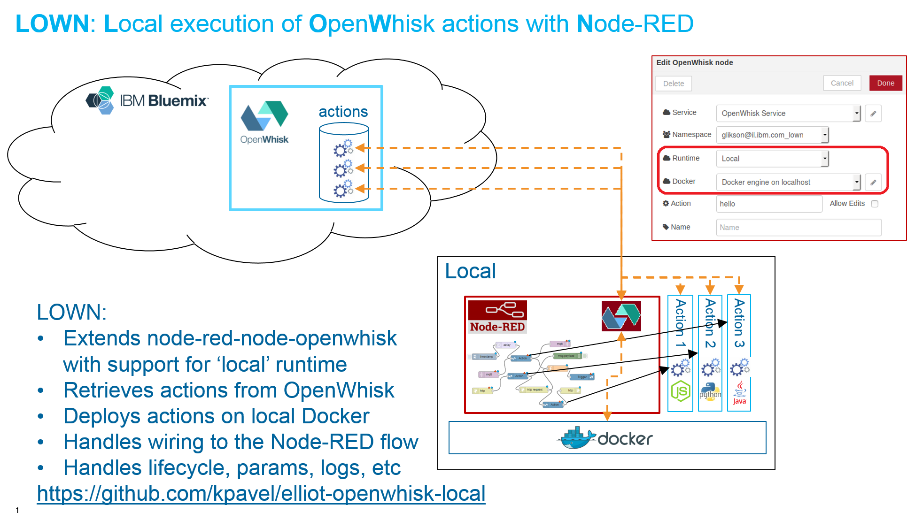

elliot-openwhisk-local
======================

***WORK IN PROGRESS*** - DO NOT use this node except for experimentation.

A set of Node-RED nodes for interacting with Apache OpenWhisk (such as [IBM Bluemix OpenWhisk](https://console.ng.bluemix.net/openwhisk)).

Includes a 'local' mode, where Node-RED is using a local Docker API to provision and manage local instances of OpenWhisk action containers (retrieved from a remote OpenWhisk service on demand).



Currently Node-RED itself must run in a container managed by the same Docker endpoint (to simplify connectivity setup). Docker API can be accessible on a local socket (e.g., with `/var/run/docker.sock` mapped from the Docker host into Node-RED container), or via a remote API.

Such a setup can be useful on embedded devices (such as IoT gateways), micro-clouds (e.g., single edge server), etc.

# Local Mode Setup
## Prereqs
You need a Docker host, where the entire deployment will be hosted (both Node-RED and the action containers). You also need `npm` and `git` packages installed.
## Node-RED container
The easiest way to deploy a properly configured instance of Node-RED is by using docker-compose, using the following docker-compose.yml:
```yaml
version: '2'
services:
    node-red:
        image: nodered/node-red-docker
        user: root
        ports:
            - 8080:1880
        volumes:
            - /var/run/docker.sock:/var/run/docker.sock
            - /tmp/data:/data
```

## Base images for actions
OpenWhisk maintains in Docker hub a set of base images for native runtimes - e.g., `openwhisk/nodejs6action`, `openwhisk/pythonaction`, `openwhisk/javaaction`, etc. These (or equivalent) images must be present at the local Docker host, without the `openwhisk/` prefix (this way we can customize the local deployment as needed - e.g., building images for a different hardware architecture). For example:
```shell
$ docker pull openwhisk/nodejs6action
$ docker tag openwhisk/nodejs6action nodejs6action
$ docker pull openwhisk/pythonaction
$ docker tag openwhisk/pythonaction pythonaction
```
These images will be used to spawn containers for 'native' actions (e.g., created with `--kind nodejs:6`). For docker/blackbox actions, the respective Docker hub image will be pulled on-demand.
## Installing OpenWhisk nodes
In order to use OpenWhisk nodes in Node-RED, you need to install the required nodejs modules in the `/data` volume specified in `docker-compose.yml` above:
```
$ cd /tmp/data
$ npm install kpavel/elliot-openwhisk-local
```
## Run
Now you can start the Node-RED container:
```
$ docker-compose up
```
Then open the Node-RED editor at `http://<your-docker-host>:8080/`, and start building the flow (alternatively, put your pre-designed `flows.json` in the data directory). In order to set up an OpenWhisk Action node to run locally, specify "service", "namespace" and "action" as with regular OpenWhisk Action node, then specify "Local" in the "Runtime" drop-down, and select "Docker engine on localhost" in "Docker" drop-down (the passthru of `/var/run/docker.sock`, as specified in the respective volume mapping in `docker-compose.yml`, ensures that Docker socket is available within the Node-RED container too).

That's it! Now once you click 'Deploy', new container will be provisioned on your Docker host, the action code will be loaded into it and the action will be invoked locally (wired to the rest of the flow, as usual).

Enjoy the local mode!

Instructions for working with the original node-red-node-openwhisk package can be found in https://github.com/ibmets/node-red-node-openwhisk/blob/master/README.md
